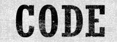
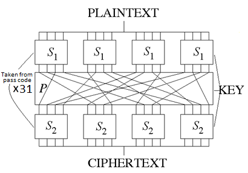

  

This is an encryption program using a substitution – permutation network.  The cipher uses a symmetric key- so the same key is used for encryption and decryption           

Up to 10,000 characters can be encrypted. All English letters and numbers can be used as well as the characters !@#$%^&\*()-\_ All letters are automatically converted to uppercase.

- The code is made up of three pass codes.

The same three pass codes are required for encryption and decryption.  Between 6 to 12 characters per pass code are required. The ability to decrypt your message relies on your ability to keep the code words safe and to use this program.  

This cipher program uses three encryption methods.  Substitution, permutation and random characters.  The substitution and most permutation functions are dictated based on the passcodes.  

##Substitutions

Substitutions change the characters.  The substitutions can either be direct substitution or functions of other the characters in the message.

##Vigenère / Bellaso**

Each letter in the text and in the passcode are converted to respective numbers and added or subtracted together to give a resulting number.  Each resulting number is converted into a letter. Therefore, two same characters can be ciphered into different characters.  As such frequency attacks can be neutralised. 

## Avalanche cipher

Each character from the plaintext message is converted to a number.  A number taken from the passcode is added to first number of the message. Starting from the second position of the message, the resulting number is then added to the preceding number from the message. This means one change in the message will affect all letters in the ciphertext.  Once completed, the numbers will be converted to ciphertext characters.

**Two-character arrays**

## Two-character arrays

The characters from the plaintext message are substituted with characters from a 2D array.  Therefore, each character will become two characters. The two characters from the 2D array representing each letter from the message can be varied in different permutations.

## Hill function

The characters are converted into numbers, segmented and grouped into separate 1D matrices. A predefined constant matrix is multiplied by each number from each 1D matrix to give each resulting number.  Each resulting number is converted back into a character. The properties of matrix multiplication mean that the value of the multiplication is a result of the number, its three adjacent numbers and its position in the 1D matrix.  

## Permutations

Permutations change the order of characters in the text.  On its own, permutations offer little protection but in combination with 2D array functions and substitution and random numbers, they can greatly increase the effectiveness of those functions.  

Many permutations in this cipher will rely on number orders from the pass codes.  The characters from the passcode code are converted to numbers.  The order of the numbers is recorded and used for the ordering of the permutations.

## Column Transposition

The letters in the text are placed in a matrix.  The order of column transposition is completed as per the order in the pass code

## Rearrangement of groups of letters

Groups of letters are rearranged as per the pass code

## Rearrangement within a group

Letters within a group are rearranged as per the pass code

## Reversal of letters

The order of all letters in the text are reversed.  This does not require a pass code.  The function is included in case the code words have a bias towards one end of the text.  Reversing the text ensures both ends of the text are ciphered.  This is to ensure that the cipher has good mixing capabilities in case there is a bias towards one end of the ciphertext.

## Grouping odds and evens

The odd and even letters are grouped together.  The function repeats as dictated by a number from the pass code.  

## Other functions

- **Random letters**

At certain points during the cipher random letters will be added.  These extra random letters will be diffused into the cipher text through substation and permutations.  For every 10 characters there will be at least 49 ^ 2x possible ciphertext possibilities.

- **Code numbers and cipher numbers**

As shown above the substitution or permutation functions typically use code numbers (generated from the code words) and cipher numbers (generated from the message letters). Both the output from the code numbers and cipher number numbers have shown to generate “random-like” numbers.  Even the smallest change in the code words or the plain text message will result in a seemingly uncorrelated new set of random code numbers and cipher numbers respectively.

## Features of the program

- **Variable cycles**

The cipher program uses between 12 to 60 cycles of the substitution permutation functions listed above.  The number of cycles is based on the code number. Since the number of cycles is variable, it is not known which cycle was the last.  Therefore, it is hard to find a starting point to break the cipher.

- **Orthogonal functions**

The cipher uses 14 lists of code numbers.  12 lists are taken from the same function.  One list uses an additional add-on function based on one of the lists.  This is to ensure that on the exceedingly rare chance of the code numbers being all zeros, that the new list will not be all zeroes.   One additional list is using a separate function.  Both functions produce seemingly random numbers.  Having two separate functions means that it will be harder to break the cipher.

- **Variable list lengths**

The length of each list is between 19 to 43 characters.  The exact length is based on the length of the pass codes.  The variable length of the lists makes it more difficult to determine the period of the substitution ciphers which is a way to start to break the cipher.

## Random numbers

Many ciphers are based on blocks.  This cipher encrypts the text in one big block.  The program can do this with the addition of two random numbers per ten characters in the message.  Therefore, larger messages will have more random numbers diffused into the message.  So, whether the message to encrypt is small or large, it is not expected to make a difference to the security of the encryption.

## Tips to make strong ciphers

The strength in the cipher lies with the pass codes.  It is recommended to use random passcodes.  Personally, I believe having one passcode using 12 characters, a second passcode of 11 characters and a third cipher of between 10 to 12 would offer the best security.

It is recommended not to use the same passcodes in different messages.

Keep the pass codes as securely as possible 

## Weakness of the cipher

- **Brute force**

The cipher is theoretically vulnerable to brute force attacks.  However, using a random passcode of between 6 to 12 characters for each passcode, there would be between 49^18 to 49 ^36 possible combinations. Therefore, a brute force is currently not feasible as there are too many possible passcode combinations with current computing strength.

- **Dictionary words**

However, if dictionary words are used as the pass codes, then the amount possible combinations are diminished.  There are about 80,000 English words between 6 to 12 characters.  Therefore only 80,000^3 combinations are needed for a brute force attack if English dictionary words were used.

- **Pass code security**

By far the biggest risk to the security of the cipher is ensuring that the pass codes are kept safe and secure.  If the pass codes are lost, then is not possible to decrypt the ciphertext.  If the pass codes are found out, then the ciphertext can easily be decrypted using this program.  Ways the pass codes can be found out is during transfer of the passcodes, recording the passcode insecurely either electronically or physically or being coerced to reveal the pass codes 

